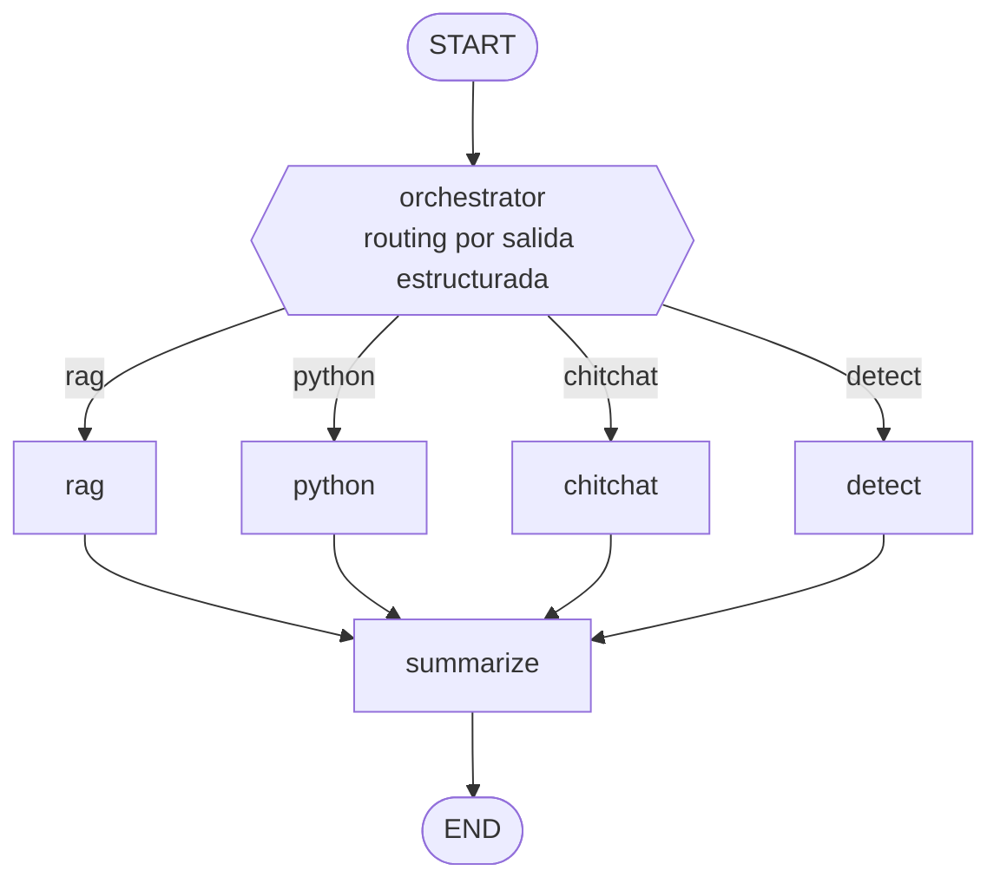

# Chatbot RAG multimodal + servicio de detección de objetos

> 📄 [Enunciado de la prueba](STATEMENT.md) · 📝 [Respuestas teóricas (Apartado 2 y extra del Apartado 3)](ANSWERS.md)

Prueba técnica. Solución **dockerizada** con 4 contenedores:
Se ha decidido utilizar 4 contenedores por simular un entorno real con diferentes servicios.

| Servicio   | Rol                                                                 | Puerto host |
|------------|---------------------------------------------------------------------|-------------|
| `chroma`   | Base de datos vectorial (modo servidor)                             | 8001        |
| `vllm`     | vLLM sirviendo `gemma-4-E2B-it-qat-w4a16-ct` (multimodal + tools)   | 8000        |
| `detector` | FastAPI + YOLO, detecta `person` y `car` (Apartado 3)               | 8002        |
| `app`      | Chainlit (UI) + LangGraph (backend) + embeddings CPU + CLI ingesta  | 8501        |

## Requisitos

- Docker + Docker Compose.
- GPU NVIDIA con WSL2 + NVIDIA Container Toolkit (para `vllm`).
- Token de Hugging Face si el modelo es *gated*.

## Arranque

```bash
cp .env.example .env          # rellena HUGGING_FACE_HUB_TOKEN si hace falta
docker compose up -d --build  # la primera vez vLLM descarga el modelo (varios minutos)
docker compose ps             # espera a que vllm y chroma estén healthy
```

## Ingesta de documentos

1. Copia tus PDFs en `docs/` (incluye al menos uno con imágenes y uno tipo formulario).
2. Lanza la ingesta:

```bash
docker compose run --rm app python -m app.ingest          # añade a lo existente
docker compose run --rm app python -m app.ingest --reset  # vacía y reingesta
```

La ingesta:
- Indexa el **texto** (chunks) en Chroma.
- Extrae **imágenes**, las describe con Gemma (visión) e indexa esas descripciones
  (`data/images/`).
- Si la primera página es un **formulario**, hace **extracción estructurada** a
  `data/extractions/<pdf>.json` (no se guarda en la vector DB).

## Uso del chatbot

Abre <http://localhost:8501>. Puedes:

- **Preguntar por los documentos** (RAG con cita de fuente).
- **Preguntar por las imágenes** de los PDFs.
- **Subir una imagen** y preguntar "¿cuántos coches/personas hay?" → invoca el detector.
- **Pedir cálculos** ("calcula la media de…", "grafica…") → genera y ejecuta Python.
- La **memoria** se resume automáticamente al superar `SUMMARY_TOKEN_THRESHOLD` tokens.

## Servicio de detección (Apartado 3) por separado

El servicio es autónomo y se puede llamar desde Postman o Python.
Se ha decidido integrarlo además en el agente, como un nodo independiente del
grafo (`detect`, ejecución estática sin pasar por el LLM) para validar también
su funcionamiento end-to-end.

```bash
# multipart (Postman: POST form-data, key "file" tipo File)
curl -F "file=@image.jpg" http://localhost:8002/detect
```

```python
import requests
r = requests.post("http://localhost:8002/detect",
                  files={"file": open("image.jpg", "rb")})
print(r.json())
# {"detections": [{"label": "car", "confidence": 0.94, "box": [...]}, ...],
#  "counts": {"car": 1, "person": 0}}
```

## Arquitectura (resumen)



- **Grafo LangGraph**: `orchestrator` (routing por salida estructurada) →
  `rag` | `python` | `chitchat` | `detect` → `summarize` → END.
- **Detección de objetos**: nodo `detect` independiente y **estático (sin LLM)**.
  Se enruta solo si se pide detectar/contar personas o coches y hay una imagen
  disponible (subida en el chat o ya presente en el contexto de la conversación).
- **RAG**: Chroma con una colección que mezcla texto e imágenes (descritas por el LLM),
  diferenciados por metadata. El **chunking es semántico** (no por número fijo de
  caracteres): el enunciado recalca que los PDFs son largos, y trocear por
  unidades de significado mantiene mejor el contexto en la indexación y la
  recuperación. El retrieval usa `k=4` para no introducir ruido, dado que **no
  hay reranker** (queda fuera del alcance de la prueba, pero sería la mejora
  natural: recuperar más candidatos y reordenarlos con un cross-encoder).
- **Memoria**: `SqliteSaver` persiste el estado por `thread_id`; un nodo propio resume
  al superar el umbral de tokens.
- **Embeddings**: `BAAI/bge-m3` en CPU (multilingüe).

## Evaluación

Más allá de los tests de integración (`make test-all`), hay un mini-arnés de
evaluación de calidad sobre un **golden set** (`tests/golden_set.json`, 8 casos
alineados con los Starters de la UI):

```bash
make eval                       # métricas + LLM-as-judge
make eval ARGS=--no-judge       # solo checks deterministas (más rápido)
```

Por cada caso mide: acierto de **enrutado** del orquestador, **recuperación de
imágenes** cuando aplica, presencia de **palabras clave** en la respuesta
(cálculos, datos recordados…), **calidad** vía LLM-as-judge (fidelidad y
relevancia) y **latencia**. Al final imprime un resumen agregado (accuracy de
routing, tasa de aciertos del juez, latencia media). El golden set incluye un
caso de *fuera de alcance* (preguntar por algo que no está en los documentos)
para vigilar la fidelidad / anti-alucinación del RAG.

> El juez usa el mismo modelo 2B, así que es un evaluador débil; en un caso real
> se delegaría en un modelo superior o en un framework como RAGAS. Sirve aquí
> como esqueleto del *loop* de evaluación.

## Limitaciones conocidas

- El nodo de Python ejecuta código generado por el LLM dentro del contenedor.
  Tiene una guarda ligera (`app/graph/python_guard.py`): timeout de 10s y
  bloqueo de imports de sistema/red (`os`, `subprocess`, `socket`, etc.), pero
  no es un sandbox real; en producción requeriría uno (gVisor, contenedor
  efímero, etc.).
- `yolov8n` corre en CPU por defecto para dejar la VRAM a vLLM (configurable a GPU).
